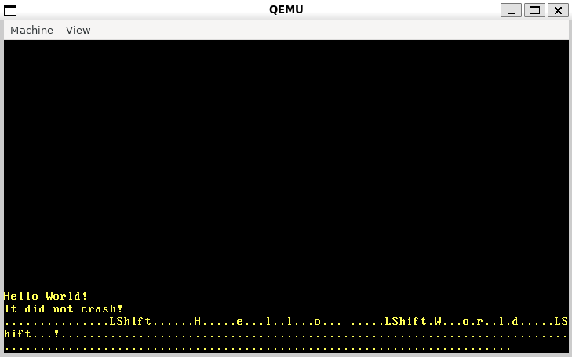
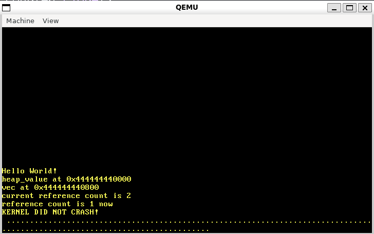

# atlas

https://os.phil-opp.com/minimal-rust-kernel/

Minimal Rust kernel with device drivers, for x86_64 CPU architecture. Built to experiment with Rust device drivers, kernel vs user space, etc.

The hope is to apply experiments learned here to building various drivers and protocols such as:

-   virtual audio cable
-   rSync port
-   Kernel:User delta encoding through drivers where applicable
-   compressed file deltas for automated backups, with support for Kernel/User space hydration + point in time restores
-   Kernel virtual machines

## Prerequisites

-   Rust (1.80+, 2021 edition)
-   QEMU

## Setup

1. Clone the repository
2. `cargo run`

## Testing

run full integration test suite:

```bash
cargo test
```

run specific test(s):

```bash
cargo test --test <test_name>
```

## Progress

-   2/22/2025



